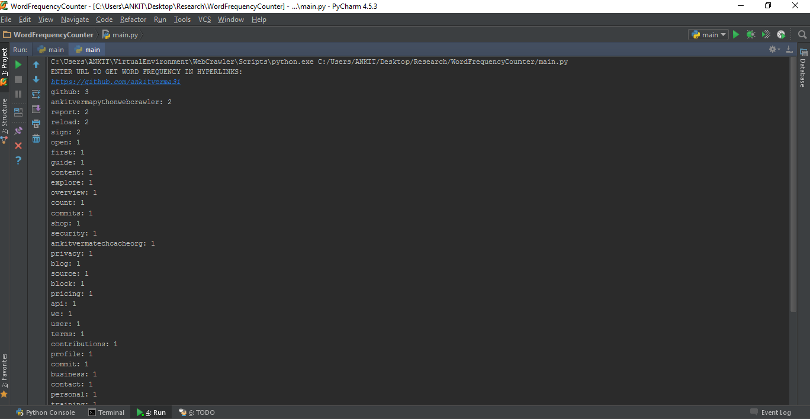

# Word Frequency Counter
###Introduction
This python word counter tool basically takes an url as inpunt and gives the frequency of words in links on that page.

Basic useful feature list:

 * Takes url of page as an input
 * prints the word and its frequency

## Steps To Run:

 * Download Project
 * Install modules requests,beautifulsoup4 using pip installer(eg: pip install requests)
 * Run main.py file
 
## Output Screenshot:

